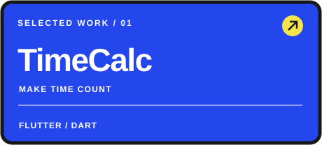
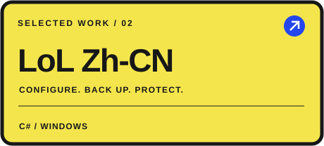
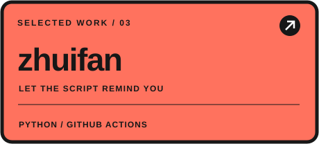
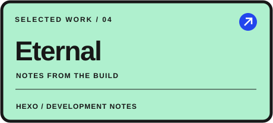

  

 

喜欢做解决实际问题的小工具，也关注交互与视觉设计。这里放我正在维护的项目、实验，以及写下来的开发经验。

## 01 / 精选项目

<table>
<tr>
<td width="50%" valign="top">

倒计时、计划日历、重复任务与进度统计，把长期目标拆成每天可执行的安排。

<a href="https://github.com/xiegaoxiao/timecalc">查看源码 ↗</a>
</td>
<td width="50%" valign="top">

简体中文配置、备份恢复与持续检测保护，提供 Windows 图形界面和命令行版本。

<a href="https://github.com/xiegaoxiao/lol-zh-cn-tool">查看源码 ↗</a> · <a href="https://github.com/xiegaoxiao/lol-zh-cn-tool/releases/latest">下载 Release</a>
</td>
</tr>
<tr>
<td width="50%" valign="top">

用自动化流程跟踪番剧开播时间，把提醒交给脚本。

<a href="https://github.com/xiegaoxiao/zhuifan">查看源码 ↗</a>
</td>
<td width="50%" valign="top">

记录开发过程、技术尝试与复盘，让经验可以再次使用。

<a href="https://github.com/xiegaoxiao/xiegaoxiao.github.io">查看源码 ↗</a>
</td>
</tr>
</table>

## 02 / 常用技术

| 方向 | 技术 |
| :--- | :--- |
| 后端与脚本 | Java · Spring Boot · MyBatis · Python |
| 前端与交互 | Vue · React · JavaScript · Vite · Pinia |
| 桌面与移动端 | C# · .NET Framework · Flutter · Dart |
| 工程与部署 | Git · Docker · GitHub Actions · Apifox |

## 03 / 做事的方式

**先解决问题，再打磨体验。** 从一个具体需求出发，让功能、界面和文档一起完善。

**把过程留下，把成果分享。** 用源码和开发记录说明工具怎么工作，也欢迎通过项目 Issue 交流反馈。

---

  <strong>CODE / CREATE / SHARE</strong> 
  把想法做成工具，把工具做得好用。

