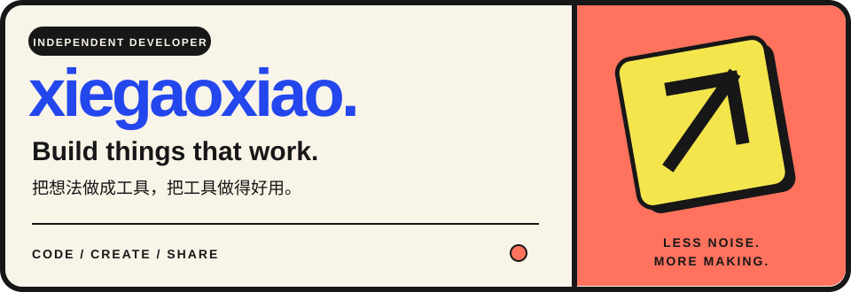
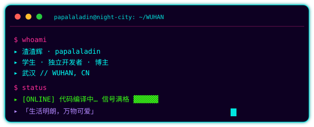

 

  

<!-- 社交徽章 -->

---

## 🧠 技能矩阵 // SKILL MATRIX

**后端 BACKEND**
 

  

**前端 FRONTEND**
 

  

**移动端 MOBILE**
 

  

**工具与部署 TOOLKIT**
 

> 🎮 兴趣：数码科技 · 智能家居 · 设计开发 · 算法与数据结构 · 黑神话 · 追番

---

## 🚀 项目 // PROJECTS

| 项目 | 简介 | 语言 |
| --- | --- | --- |
| [⏱️ **TimeCalc**](https://github.com/xiegaoxiao/timecalc) | 时间计算器：把长期目标拆成今天就能执行的事。倒计时 · 计划日历 · 重复任务（含艾宾浩斯间隔复习）· 进度统计 · 备份与 WebDAV 同步 | Dart / Flutter |
| [🐍 **zhuifan**](https://github.com/xiegaoxiao/zhuifan) | 番剧开播精确到分钟推送微信：GitHub Actions + Server 酱，零成本 · 零运维 · 零状态 | Python |
| [✍️ **Eternal Blog**](https://github.com/xiegaoxiao/xiegaoxiao.github.io) | 个人博客「Eternal」源码（Hexo · AnZhiYu 主题） | HTML / Hexo |

---

## 📊 系统监控 // SYSTEM MONITOR

---

📡 **接入频道**　·　[博客](https://blog.imaeternal.cn/)　·　[GitHub](https://github.com/xiegaoxiao)　·　[公众号：一条猫的编程日记](https://mp.weixin.qq.com/)　·　QQ `2914213073`

 

⛨ SYSTEM ONLINE — 数据已加密传输 · 主页 v2.0 CYBERPUNK

